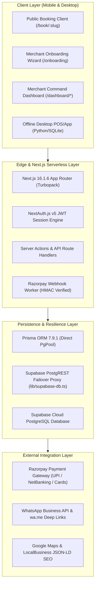

# Docodo.in — Architecture & Feature Inventory

**Document Reference:** `docs/audit/ARCHITECTURE_AND_FEATURE_INVENTORY.md`  
**Review Standard:** Enterprise Full-Stack SaaS Audit  
**Date:** 10 October 2026  

---

## 1. System Architecture Overview

Docodo is engineered as a hybrid cloud-and-edge business operating system tailored for high availability, low latency across Indian mobile networks, and frictionless self-service operation.

---

## 2. Core Technological Stack

| Tier | Component | Technology / Library | Purpose & Specification |
| :--- | :--- | :--- | :--- |
| **Frontend Framework** | Web Core | Next.js 16.1.6 (Turbopack) | Server Components, Streaming SSR, and Static Site Generation across 55+ routes. |
| **Runtime & Language** | Core Language | TypeScript 5.8 / React 19 | Strict type checking, zero `any` leaks in critical paths. |
| **Styling & Design** | UI System | Tailwind CSS + Lucide React | High-contrast dark obsidian theme, responsive mobile-first grid, WCAG compliant. |
| **Visual Effects** | 3D Graphics | Three.js / `@react-three/fiber` | Ambient 3D canvas rendering for interactive landing page engagement without blocking main thread. |
| **Authentication** | Auth Engine | NextAuth.js v5 (Auth.js) | Stateless JWT cookie sessions, bcryptjs password hashing, role-based access control (`MERCHANT`, `ADMIN`). |
| **Database & ORM** | Primary Data Access | Prisma 7.9.1 + PgBouncer | Typed relational access to PostgreSQL schema (`User`, `Business`, `Booking`, `Service`, `Customer`, `Subscription`). |
| **Resilient Failover**| Data Fallback | `frontend/src/lib/supabase-db.ts` | Resilient proxy wrapping Supabase PostgREST API when direct pool connection times out. |
| **Payment Gateway** | Billing & Checkout | Razorpay Node.js SDK | Order generation, timing-safe HMAC SHA-256 signature verification, recurring SaaS subscriptions. |
| **Desktop / Offline** | Local Station | Python 3.12 / SQLite / Pytest | Local caching, offline appointment access, and terminal utilities. |

---

## 3. Exhaustive Feature Inventory

### 3.1 Public Storefront & Conversion Funnel
1. **Homepage (`/`):**
   - Interactive hero with value proposition: *"Turn Enquiries into Bookings in 15 Minutes"*.
   - Live booking simulator enabling merchants to experience customer scheduling in 10 seconds.
   - Transparent pricing comparison (0% commission vs. aggregator take-rates).
   - Dynamic FAQ and customer testimonials.
2. **Programmatic Niche Landing Pages (`/for/[slug]`):**
   - Statically generated landing pages for high-converting service verticals:
     - `/for/salons-and-spas`
     - `/for/dental-clinics`
     - `/for/fitness-trainers`
     - `/for/ayurveda-wellness`
     - `/for/independent-consultants`
   - Vertical-specific JSON-LD `LocalBusiness` structured data for search engine discovery.
3. **Public Booking Storefront (`/book/[slug]`):**
   - High-speed mobile booking interface hosted at clean merchant slugs.
   - Dynamic service selector with transparent pricing, duration, and descriptions.
   - Real-time date & time slot availability engine.
   - Dual payment options:
     - **Instant Online Payment:** Seamless Razorpay modal with UPI, GPay, PhonePe, and Credit/Debit cards.
     - **Pay at Venue:** Immediate slot confirmation with status `CONFIRMED` and payment method `CASH_ON_DELIVERY`.
   - Post-booking confirmation card with instant WhatsApp calendar add and directions.

---

### 3.2 15-Minute Onboarding Engine (`/onboarding`)
A 5-step guided wizard designed for busy business owners:
1. **Step 1 — Business Profile:** Business Name, Category selection, Contact Phone, and City/Location.
2. **Step 2 — Services & Pricing:** Dynamic service creation (Title, Price in INR, Duration in minutes).
3. **Step 3 — Operating Schedule:** Business hours, weekly off-days, and appointment buffer intervals.
4. **Step 4 — Payment & WhatsApp Setup:** UPI VPA input, Pay-at-Venue enablement, and notification preferences.
5. **Step 5 — Instant Launch & Handoff:** Automatic guest user provisioning, password assignment, slug creation (`/book/business-slug`), 1-click clipboard copy, and direct transition to the merchant dashboard.

---

### 3.3 Merchant Command Dashboard (`/dashboard/*`)
- **Dashboard Overview (`/dashboard`):** Today's appointments, monthly revenue, pending confirmations, and quick booking links.
- **Appointments & Calendar (`/dashboard/bookings`):** List and day/week calendar views, status transitions (`CONFIRMED`, `COMPLETED`, `CANCELLED`, `NO_SHOW`), and manual booking creation for walk-in clients.
- **Client CRM (`/dashboard/customers`):** Central customer directory, total visits, lifetime spend, notes, and direct WhatsApp chat links.
- **Service Menu (`/dashboard/website`):** Dynamic catalogue editor for adding, toggling, or reordering services and updating cover images.
- **WhatsApp Automation (`/dashboard/whatsapp`):** Configuration for booking confirmations, 24h reminders, and review requests.
- **Marketing Automation (`/dashboard/automations`):** Win-back campaigns for inactive clients (30/60/90 days) and birthday offers.
- **AI Content Generator (`/dashboard/ai-content`):** Generates Instagram captions, promotional WhatsApp broadcasts, and seasonal festival offers in seconds.
- **Revenue OS (`/dashboard/revenue-os`):** Advanced financial analytics, average order value (AOV), top revenue services, and projection models.
- **Growth OS (`/dashboard/growth-os`):** Referral tracking and merchant viral loops.
- **Settings & Business Profile (`/dashboard/settings`):** Slug modification, logo upload, working hours, and Razorpay API key configuration.

---

### 3.4 API & Background Workers
- **External Public API v1 (`/api/v1/bookings`):** Authenticated REST endpoint for external integrations and POS terminal syncing.
- **Order Creation Endpoint (`/api/create-order`):** Secure server-side Razorpay order generation with metadata tags.
- **Payment Verification (`/api/verify-payment`):** Verifies payment signature and auto-provisions entitlements.
- **Webhook Listener (`/api/webhooks/razorpay`):** Timing-safe HMAC SHA-256 listener processing asynchronous payment captures and recurring subscription renewals.
- **Automated Cron Reminders (`/api/cron/reminders`):** Scheduled worker identifying appointments within 24h/2h windows and dispatching WhatsApp/Email reminders.
