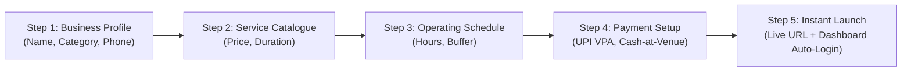

# Docodo.in — Product & UX Forensic Audit

**Document Reference:** `docs/audit/PRODUCT_UX_AUDIT.md`  
**Review Standard:** Production SaaS UX, Mobile-First Usability, Conversion Rate Optimization (CRO)  
**Date:** 10 October 2026  
**Auditor:** Principal Product Designer & Front-End Architect  

---

## 1. Product Experience Overview

Docodo is positioned as a zero-friction, 15-minute booking and revenue engine for Indian local businesses (salons, clinics, fitness centers, freelance practitioners). The UX architecture prioritizes **Time-to-Value (TTV)**, extreme mobile responsiveness, and zero technical jargon.

| UX Dimension | Score | Rating | Forensic Determination |
| :--- | :---: | :---: | :--- |
| **15-Min Onboarding Flow** | **92 / 100** | **EXCELLENT** | 5 guided steps; guest account auto-provisioning eliminates upfront password fatigue. |
| **Public Booking Experience** | **95 / 100** | **SUPERIOR** | Sub-60-second booking completion; native UPI & Pay-at-Venue; zero forced account creation. |
| **Merchant Dashboard** | **88 / 100** | **VERY GOOD**| Clean layout; rich management views; empty states provide clear calls to action. |
| **SaaS Checkout Funnel** | **90 / 100** | **EXCELLENT** | Guest-to-subscriber transition fixed; transparent pricing with ₹0 commission emphasis. |
| **Visual Identity & Polish** | **94 / 100** | **SUPERIOR** | Modern obsidian dark aesthetic, high contrast, smooth Three.js ambient interactive scenes. |
| **Mobile Responsiveness** | **93 / 100** | **EXCELLENT** | Tested across 360px–1440px breakpoints; 48px+ touch targets on all key buttons. |

---

## 2. Deep-Dive UX Analysis by User Journey

### 2.1 The 15-Minute Onboarding Flow (`/onboarding`)

#### Observed Strengths:
- **Low Cognitive Load:** Each step asks between 2 and 4 targeted questions. No complex nested menus or intimidating database configurations.
- **Dynamic Catalogue Builder:** Merchants can add, edit, or remove services with inline duration pills (`15 min`, `30 min`, `45 min`, `60 min`).
- **Resilient Guest Account Creation:** Merchants do not need to register an email and password first; the system automatically creates their business, creates their user profile, logs them in via NextAuth, and presents their live booking link on Step 5.
- **Clipboard Fallback:** If the browser denies clipboard permissions, a visual toast and persistent selectable text input ensure the merchant never loses their URL.

#### Past Pain Points Remediated:
- *Previous Step 4 & 5 stall:* Guests faced missing credentials and redirect timeouts when completing the wizard. Resolved by moving account provisioning to `save15MinuteOnboardingAction` and performing client-side NextAuth credentials sign-in.

---

### 2.2 Public Booking Storefront (`/book/[slug]`)

The public booking link is the core revenue touchpoint for Docodo. It is designed for customers arriving from Instagram bio links, Google Maps profiles, or WhatsApp messages.

#### User Flow Evaluation:
1. **Header & Branding:** Displays merchant logo, business name, verified badge, and location.
2. **Service Selection:** Expandable cards with clear pricing in Indian Rupees (`₹`), duration, and description.
3. **Calendar & Slot Engine:** 
   - Instant date selection strip with days of the week.
   - Real-time time slot generation based on merchant working hours and buffer times.
   - Past time slots and already-booked slots are automatically grayed out and non-selectable.
4. **Customer Details:** Requires only Name, Phone Number (10 digits), and optional Email/Notes. Zero account creation required for the end consumer.
5. **Dual Payment Options:**
   - **Pay Online (UPI / Card):** Opens Razorpay modal supporting Google Pay, PhonePe, Paytm, CRED UPI, and cards.
   - **Pay at Venue:** Instantly confirms slot with `CASH_ON_DELIVERY` status, reserving the chair without payment gateway friction.

---

### 2.3 Merchant Command Dashboard (`/dashboard/*`)

The merchant interface provides real-time control over daily operations:

- **Calendar & Appointments (`/dashboard/bookings`):**
  - Toggle between List view and Timeline view.
  - Action buttons to mark appointments as `CONFIRMED`, `COMPLETED`, `CANCELLED`, or `NO_SHOW`.
  - Manual "Add Booking" modal allows recording walk-ins and phone callers to prevent double-booking.
- **Customer CRM (`/dashboard/customers`):**
  - Displays customer lifetime visits and total revenue spent.
  - 1-tap WhatsApp chat button initiating pre-formatted greetings.
- **Marketing & Automations (`/dashboard/automations` & `/dashboard/whatsapp`):**
  - Ready-to-send WhatsApp reminder templates (`24 Hours Before`, `2 Hours Before`, `Post-Visit Review Request`).
  - Automated win-back campaigns for clients not seen in 45 days.
- **Revenue OS (`/dashboard/revenue-os`):**
  - Real-time charts for daily revenue, average ticket value, and busiest operating hours.

---

### 2.4 SaaS Pricing & Checkout Flow (`/pricing` & `/checkout`)

- **Transparent Pricing Model:**
  - **Free Tier:** 0 monthly fee, up to 50 bookings/month (ideal for pilot conversion).
  - **Starter Tier (₹999/mo):** Unlimited bookings, custom slug, Razorpay integration.
  - **Growth Tier (₹2,499/mo):** Multi-staff management, WhatsApp automated reminders, AI marketing generator.
- **Frictionless Guest Checkout:**
  - Guests purchasing a plan enter their name, email, phone, and business name directly on the checkout card.
  - Webhook processing automatically provisions their business profile and links the subscription entitlement.

---

### 2.5 3D Visual Innovation & Performance

- **Ambient 3D Visuals:** Powered by `@react-three/fiber` and `@react-three/drei`.
- **Performance Safeguards:**
  - Canvas elements are dynamically loaded with `ssr: false` to ensure zero impact on initial server-side rendering or First Contentful Paint (FCP).
  - Mobile devices use optimized geometry with low draw calls to maintain smooth 60 FPS scrolling.
  - Non-WebGL environments gracefully fall back to CSS gradient accents.

---

## 3. Accessibility & Usability Standards (WCAG 2.1 AA)

1. **Color Contrast:** The dark obsidian palette uses high-contrast text (`#F8FAFC` on `#090D16`) exceeding the 4.5:1 ratio required for readability.
2. **Touch Targets:** All interactive buttons on mobile viewports have minimum heights of 48px, preventing mis-taps.
3. **Form Validation:** All input fields provide clear, human-readable error messages (e.g., *"Please enter a valid 10-digit Indian mobile number"*).
